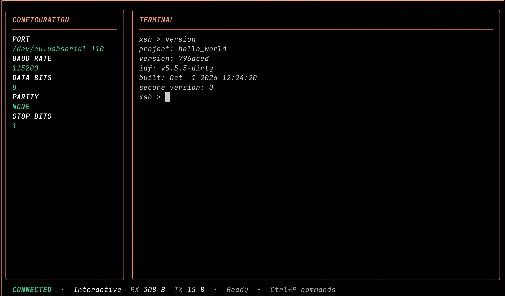
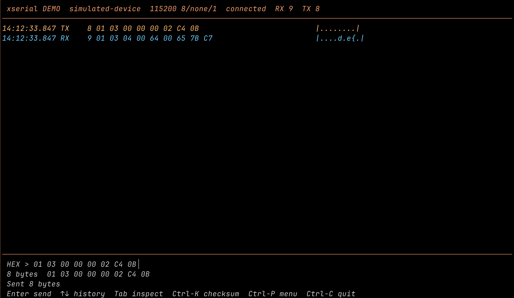

<p align="center">
  
</p>

<h1 align="center">xserial</h1>

<p align="center">
  A terminal workbench for serial communication and binary protocol debugging.
</p>

<p align="center">
  <!-- Update assets/version-badge.svg and its alt text when creating a new version tag. -->
  <a href="https://github.com/ZhiWei-Ou/xserial/tags"></a>
  <a href="https://github.com/ZhiWei-Ou/xserial/actions/workflows/ci.yml"></a>
  <a href="LICENSE"></a>
</p>

<p align="center">
  <a href="#documentation">Documentation</a> ·
  <a href="#quick-start">Try the demo</a> ·
  <a href="https://github.com/ZhiWei-Ou/xserial/issues">Report an issue</a>
</p>

<p align="center">
  English · <a href="README_zh.md">简体中文</a>
</p>

<p align="center">
  <strong>Demo (42 seconds)</strong> — RawUI, the full-screen console, and Hexdump.
</p>

https://github.com/user-attachments/assets/91dca830-0c6a-41ba-96f0-97ad97430697

## Features

- **Send and inspect bytes.** Edit validated Hex input and compare TX/RX with timestamps, lengths, Hex, and ASCII. Reuse sending history and named command favorites.
- **Understand binary fields.** Select bytes to inspect integers and floating-point values in both byte orders. Preview, append, and verify CRC16 Modbus, SUM8, and XOR8 checksums.
- **Reassemble responses.** Choose fixed-length, delimiter, length-field, or Modbus register-response framing to handle split and joined reads.
- **Debug offline.** Record original RX/TX bytes and connection events, then replay, search, mark, and export a conversation after the device is disconnected.
- **Let coding agents debug devices.** MCP tools provide a persistent serial terminal, exact-byte sending, and bounded reads with continuation cursors. One local daemon preserves the connection across client restarts.
- **Try it without hardware.** The built-in simulated device demonstrates normal responses, bad CRCs, split responses, and joined responses through the same workbench.
- **Keep a classic serial terminal.** Use byte-transparent RawUI or the full-screen terminal UI, with automatic reconnection, receive logging, timestamps, and single-file YMODEM transfer. Supports Linux, macOS, and Windows.

## Quick Start

Run the hardware-free demo from source with Go 1.26.2 or newer:

```bash
git clone https://github.com/ZhiWei-Ou/xserial.git
cd xserial
go run ./cmd/xserial demo --frame modbus-read
```

Press **Enter** to query two simulated registers. Press **Tab** to inspect the response, or **Ctrl-C** to quit. For a non-interactive preview, run `go run ./cmd/xserial demo --snapshot`.

The workbench changes have not been published as a release yet. Use the current source checkout to try them. Prebuilt binaries will be available on the [Releases page](https://github.com/ZhiWei-Ou/xserial/releases) after publication.

To build a local executable, run `make build`; it writes the binary to `bin/`. The examples below assume `xserial` is on your `PATH`. You can also replace `xserial` with `go run ./cmd/xserial` from the repository root.

## Usage

### Connect to a device console

```bash
xserial list
xserial /dev/ttyUSB0
xserial /dev/ttyUSB0 9600,7,E,2
```

RawUI sends keyboard input directly to the device and writes received bytes unchanged to `stdout`. Local messages use `stderr`. Press `Ctrl-P h` for local commands or `Ctrl-P q` to quit.

On macOS, use a device such as `/dev/cu.usbserial-0001`; on Windows, use a COM name such as `COM3`.

For a full-screen device console with an editable configuration sidebar:

```bash
xserial /dev/ttyUSB0 --TUI
```

This terminal UI is Beta. Press `Ctrl-P` for commands, `Ctrl-P c` to focus configuration, and `Ctrl-C` to quit.

<p align="center">
  
</p>

### Debug a binary protocol

```bash
xserial /dev/ttyUSB0 --workbench
xserial demo --frame modbus-read --commands examples/modbus/commands.json
```

Paste `AA 01`, `AA01`, `AA,01`, or `0xAA 0x01`; sending only happens when you press Enter. The demo favorites include all four response scenarios.

| Key | Action |
| --- | --- |
| Enter | Send the current Hex command |
| Up / Down | Browse successful sends |
| Ctrl-S / Ctrl-O | Save / load a named command |
| Tab | Inspect traffic bytes |
| Left / Right, `[` / `]` | Select byte offset and width in the inspector |
| Ctrl-K | Preview and append a checksum |
| Ctrl-F / Ctrl-B | Search Hex bytes / mark selected traffic |
| Page Up / Page Down, End | Browse traffic / follow the latest data |
| Ctrl-P / Ctrl-C | Open the command menu / quit |

RX remains a **data block** unless a framing rule is explicitly selected. Device control bytes are shown as data and never executed by the workbench. `modbus-read` uses response structure; it does not implement RTU timing or a complete Modbus master.

<p align="center">
  
</p>

### Record, replay, and export

```bash
xserial /dev/ttyUSB0 --workbench --record session.xsr
xserial replay session.xsr --frame modbus-read
xserial export session.xsr --match "00 64"
xserial export session.xsr --from 2s --to 10s --format jsonl -o excerpt.xsr
```

Replay runs offline and never opens a serial port. Space pauses, `+` / `-` changes speed, and R restarts. Search and inspection stay available after playback ends.

Live marks are saved in the recording; replay marks use a `.marks.json` sidecar. Exports include saved sidecar notes. Recording and export commands create new files and refuse to overwrite existing ones.

### View Hexdump and receive logs

```bash
xserial /dev/ttyUSB0 --hexdump --time
xserial /dev/ttyUSB0 --log device.log --time
```

Hexdump displays offsets, Hex, and ASCII in RawUI. Receive logs append device output to a file. `--time` adds `HH:MM:SS.mmm` timestamps to received lines or dump rows.

## Configuration

The connection syntax is `xserial <port> [cfg]`. Omitted trailing fields use the defaults `115200,8,N,1`:

```text
baud[,data-bits[,parity[,stop-bits]]]
```

```bash
xserial /dev/ttyUSB0 115200
xserial /dev/ttyUSB0 9600,8,E,1 --workbench --frame fixed:9
```

Parity accepts `N`, `O`, `E`, `M`, or `S`; stop bits accept `1`, `1.5`, or `2`.

| Option | Purpose |
| --- | --- |
| `--workbench` | Binary protocol debugging workbench |
| `--TUI` | Full-screen device console; Beta |
| `--commands <file>` | Workbench command favorites; defaults to the user config directory's `xserial/commands.json` |
| `--frame <rule>` | Workbench RX framing; default `chunk` |
| `--record <file>` | Original RX/TX and connection-event recording |
| `--hexdump`, `-h` | Hex and ASCII output in RawUI |
| `--log <file>` | Append received data to a file |
| `--time`, `-t` | Receive timestamps in RawUI and the terminal UI |

Framing rules include `chunk`, `fixed:N`, `delimiter:HEX`, `length:OFFSET:WIDTH:OVERHEAD:le|be`, and `modbus-read`. See the [workbench guide](docs/workbench.md) for their exact semantics.

`--workbench`, `--TUI`, and `--hexdump` are mutually exclusive. Use `--help` for CLI help; `-h` selects Hexdump. `xserial version` prints the version; `xserial --version` also shows available build metadata.

## Documentation

- [Chinese README](README_zh.md)
- [Workbench guide and Modbus examples](docs/workbench.md)
- [Recording format, replay, and export](docs/capture.md)
- [MCP device debugging and daemon lifecycle](docs/mcp.md)
- [Protocol examples and sample recording](examples/modbus/README.md)

The guides above are written in English.

## Contributing

Bug reports, documentation improvements, and pull requests are welcome. [Open an issue](https://github.com/ZhiWei-Ou/xserial/issues) with your OS, xserial version, serial configuration, reproduction steps, and expected versus actual behavior. For larger changes, describe the proposal in an issue first.

Read [AGENTS.md](AGENTS.md) before changing the code. Keep changes focused, preserve RawUI's byte transparency, and add regression coverage for behavior changes. Keep both README languages in sync.

```bash
go test ./...
go test -race ./...
make all
```

Run the unit tests for every change, the race tests for concurrent code, and the relevant cross-builds for platform changes. `make all` builds Linux, macOS, and Windows binaries for amd64 and arm64.

## License

Licensed under the [MIT License](LICENSE).
