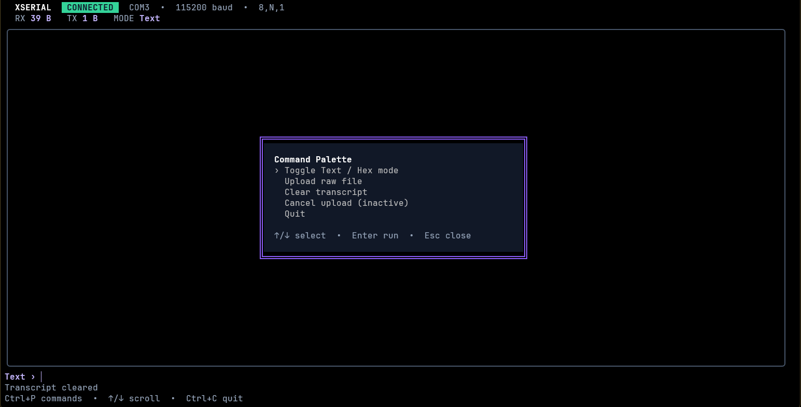

# xserial

xserial 是一个简单、可靠的跨平台串口终端。

它既可以像 `screen` 一样直接连接设备，也提供了一个更适合观察日志和控制 MCU 的全屏 TUI。你可以用它调试开发板、进入设备 Shell、查看带颜色的运行日志，或者在没有 Shell 的设备上直接收发 Hex 字节。



## 为什么是 xserial？

串口调试本来应该是一件很直接的事：找到端口、连上设备，然后开始输入和观察输出。xserial 尽量保持这个过程简单，同时补上一些日常使用中很实用的能力：

- 紧凑的连接命令，默认使用常见的 `115200 / 8,N,1` 配置；
- raw 终端模式，设备字节不会被日志或界面信息污染；
- 全屏 TUI，支持历史滚动、安全的 ANSI 颜色和命令面板；
- Text 与 Hex 收发，既能操作 Shell，也能控制二进制协议设备；
- 接收日志、行时间戳和 raw 文件上传；
- 支持 Linux、macOS 和 Windows。

## 安装

```bash
go install github.com/ZhiWei-Ou/xserial/cmd/xserial@latest
```

确保 Go 的 bin 目录已经加入 `PATH`。通常可以这样检查：

```bash
xserial --version
```

## 快速开始

先查看系统中的串口：

```bash
xserial list
```

然后连接设备：

```bash
xserial conn /dev/ttyUSB0
```

macOS 上的端口通常类似：

```bash
xserial conn /dev/tty.usbserial-0001
```

Windows 可以直接使用 COM 端口：

```powershell
xserial conn COM3
```

默认波特率是 `115200`。需要其他波特率时，把它放在端口后面：

```bash
xserial conn /dev/ttyUSB0 9600
```

## Raw 模式

不带 `--tui` 时，xserial 运行在 raw 模式：键盘输入直接发送给设备，设备返回的原始字节直接写入终端。

```bash
xserial conn /dev/ttyUSB0 115200
```

本地命令使用 `Ctrl-P` 作为 prefix。先按 `Ctrl-P`，松开后再按命令键：

| 按键 | 作用 |
|---|---|
| `Ctrl-P h` | 显示本地帮助 |
| `Ctrl-P u` | 上传一个本地文件 |
| `Ctrl-P q` | 退出连接 |
| `Ctrl-P Ctrl-P` | 向设备发送 `Ctrl-P` 字节（`0x10`） |

raw upload 是纯字节发送。它适合设备已经准备好接收固定长度数据的场景，但不提供校验、重传或断点续传。

## TUI 模式

> [!NOTE]
> TUI 目前处于 Beta 阶段，界面和交互方式仍可能调整，也可能存在尚未发现的显示问题。如果你更看重稳定性和字节透明传输，建议优先使用默认的 raw 模式。

加入 `--tui` 即可打开全屏界面：

```bash
xserial conn /dev/ttyUSB0 115200 --tui
```

TUI 会展示接收与发送字节数、当前模式、设备输出和操作状态。默认使用 Text 模式，在输入框中输入命令并按 Enter 后，xserial 会发送文本并追加一个 `CR`（`\r`）。

常用操作：

| 按键 | 作用 |
|---|---|
| `Ctrl-P` | 打开或关闭命令面板 |
| `Ctrl-C` | 退出连接 |
| `↑` / `↓` | 按行浏览历史输出 |
| `PageUp` / `PageDown` | 按页浏览历史输出 |
| `Esc` | 关闭命令面板或取消路径输入 |

命令面板中可以：

- 切换 Text / Hex 模式；
- 上传 raw 文件；
- 清空当前显示历史；
- 取消正在进行的上传；
- 退出连接。

TUI 默认保留最近 `5000` 条完整逻辑行。滚动查看历史时，新收到的数据不会把当前阅读位置强行拉回底部。

### Hex 模式

Hex 模式适合没有 Shell、直接通过字节命令控制的 MCU。通过 `Ctrl-P` 命令面板切换到 Hex 后，可以输入以空格分隔的两位十六进制字节：

```text
AA 01 FF 00 7E
```

每一组必须正好是两位 Hex 数字。发送时不会自动追加 `CR` 或换行。设备返回的数据会以经典 hexdump 格式显示，包括偏移、Hex 字节和可打印 ASCII。

Text/Hex 切换只影响之后收到的数据，已经显示的历史不会被重新解释。

## 串口帧配置

连接格式是：

```text
xserial conn <port> [baud]
```

数据位、校验位和停止位通过 `-c` 或 `--cfg` 设置：

```bash
xserial conn /dev/ttyUSB0 57600 -c 7,E,1
```

配置格式为：

```text
data-bits,parity,stop-bits
```

- parity：`N`、`O`、`E`、`M`、`S`；
- stop bits：`1`、`1.5`、`2`；
- 默认值：`8,N,1`。

## 保存设备输出

使用 `--log` 将接收到的数据追加到文件：

```bash
xserial conn /dev/ttyUSB0 --log device.log
```

还可以使用 Go 时间格式为每一行添加时间戳：

```bash
xserial conn /dev/ttyUSB0 \
  --log device.log \
  --time "2006-01-02 15:04:05.000"
```

时间格式遵循 Go 的 reference time 写法。raw 模式下，时间戳只进入日志文件，不会插入设备输出；TUI 会同时在显示内容中使用该格式。

## Shell completion

xserial 使用 Cobra 提供命令补全。例如为 Zsh 生成补全脚本：

```bash
source <(xserial completion zsh)
```

其他 Shell 的具体安装方式可以通过下面的命令查看：

```bash
xserial completion --help
```

## 常见问题

### Linux 上提示没有串口权限

多数发行版会把串口分配给 `dialout` 或类似用户组。可以先查看设备权限：

```bash
ls -l /dev/ttyUSB0
```

然后根据发行版配置用户组。重新登录后组权限才会完全生效。

### 找不到正确的端口

先运行：

```bash
xserial list
```

如果设备刚插入，可以在插入前后分别运行一次，对比新增的端口。USB 串口通常还会显示 VID、PID、序列号或产品名称。

### 如何避免设备输出被本地提示污染？

raw 模式下，设备字节只写入 stdout；xserial 自己的帮助、上传进度和错误写入 stderr。因此可以安全地重定向或管道处理设备输出。
