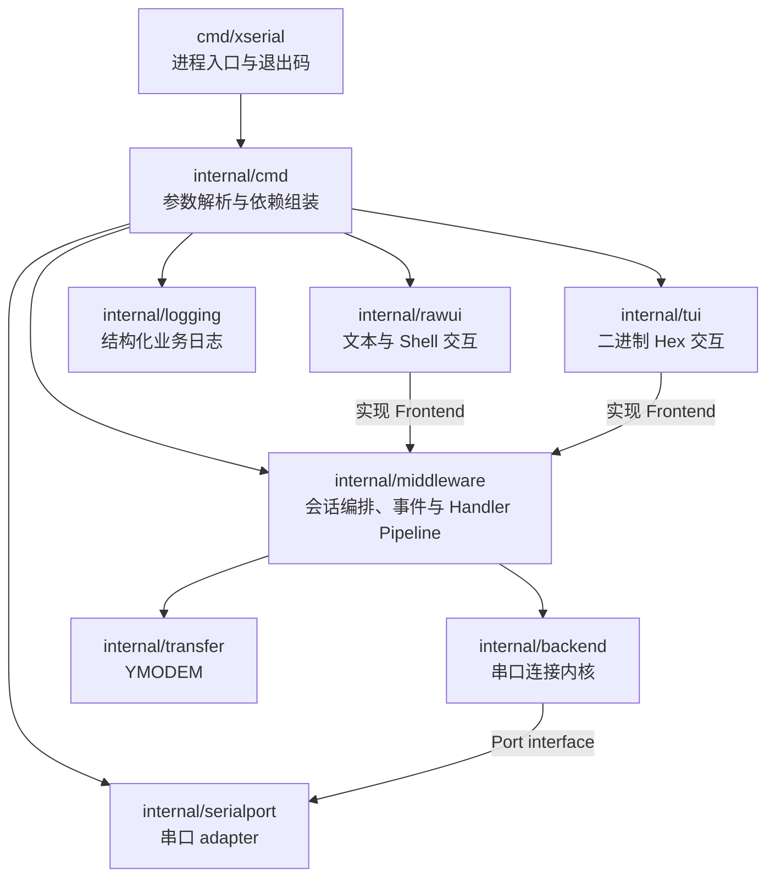
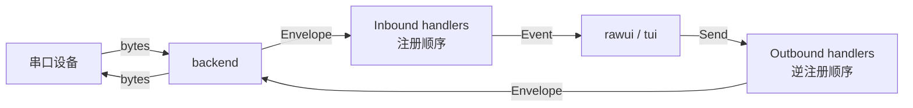
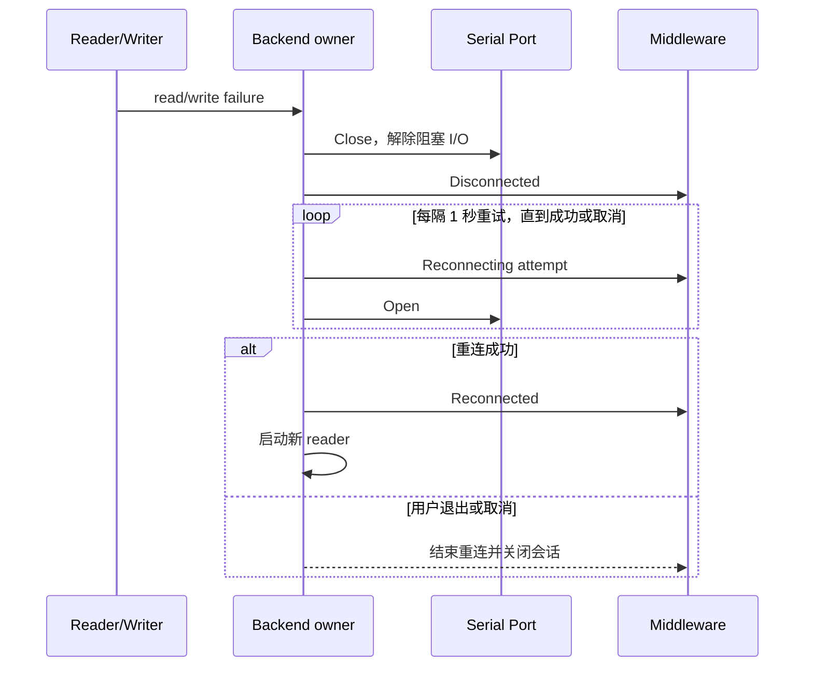

# xserial 架构

本文描述当前重构后的运行时架构。xserial 是专注于串口的 CLI 工具，采用模块化单体；`rawui` 面向文本或 Shell 设备，`tui` 面向二进制数据收发。

## 1. 分层与依赖方向



各层职责：

- `cmd/xserial` 只处理进程生命周期；`internal/cmd` 在无位置参数时显示帮助，通过 `list` 子命令列举串口，有位置参数时直接组装连接，并负责校验配置、选择 frontend 和创建依赖。
- `internal/backend` 只负责串口连接、单 reader、单 writer、断线检测、有限重连和关闭，不认识 frontend、传输协议或 Cobra。
- `internal/middleware` 是应用编排层。它把 backend 字节包装为 `Envelope`，经过双向 Pipeline 后交给 frontend；传输能力也在这一层获得方向独占权。
- `rawui` 与 `tui` 只通过 `middleware.Endpoint` 发送命令和消费事件，不直接持有串口。
- `serialport`、`logging` 是基础设施 adapter；`transfer` 封装具体发送算法。

依赖只朝内核能力方向流动，backend 不反向依赖 middleware 或 UI。

## 2. 运行时数据流



Pipeline 使用包含 `Data`、`Direction`、`At` 和 `Source` 的字节 `Envelope`。Handler 可以：

- 观察并原样转发；
- 修改字节后继续转发；
- 消费输入，阻止它到达下一层；
- 申请方向独占能力。

Inbound 按注册顺序执行，Outbound 按逆注册顺序执行，形成对称的双向中间件链。当前 Handler 由代码组合，不支持运行时外部插件或配置脚本。

这条 seam 可承载未来的过滤与重渲染需求。例如正则 Handler 可消费匹配行实现过滤；后续增加类型化 side event 后，可让 rawui 根据标注加深颜色。规则匹配与表现策略应分开，避免 middleware 直接输出 ANSI。

## 3. 方向独占与传输

Pipeline 支持四种能力：

| Capability | 语义 |
|---|---|
| `Passive` | 观察或变换，不独占方向 |
| `ConsumeInbound` | 独占消费设备输入 |
| `ExclusiveOutbound` | 独占写入串口 |
| `ExclusiveDuplex` | 同时独占输入与输出 |

动态传输通过临时 `transferGate` 进入 Pipeline：

- YMODEM 申请 `ExclusiveDuplex`，协议应答被消费到 transfer worker，不会泄漏给 rawui；
- transfer 完成或取消后移除 gate，释放方向所有权；
- YMODEM 通过 rawui 提供交互入口。

## 4. Backend 连接内核

backend 对一次物理连接维护一个 reader 和一个 writer。所有写入调用 `transfer.WriteFull` 处理短写；收到的数据复制后再发出事件，避免复用 read buffer。



后台无限重连、固定间隔 1 秒，可由用户退出或取消；CLI 不提供重连参数，重试过程不打印警告日志。backend 只允许生命周期所有者替换和关闭当前 port，旧连接事件通过 generation 隔离。

## 5. Frontend 契约

Frontend 依赖 middleware 的窄接口：

```go
type Frontend interface {
    Run(context.Context, Endpoint) error
}

type Endpoint interface {
    Events() <-chan Event
    Send(context.Context, []byte) error
    StartYMODEMUpload(context.Context, string) error
    StartYMODEMDownload(context.Context, string) error
    CancelTransfer()
    Quit()
}
```

### rawui

- 进入终端 raw mode，并保证所有返回路径恢复终端；
- 默认情况下普通字节透明地在 stdin/stdout 与串口之间传递；启用 `--time` 后，仅接收显示按行增加时间前缀；
- `Ctrl-P` 状态机解释本地帮助、退出和 YMODEM；
- 本地提示、进度和错误只写 `stderr`，使用 CRLF；
- 断线和重连状态作为本地提示展示，不污染设备 stdout。

### tui

- 只面向二进制数据，不提供 Text 模式或 YMODEM 入口；
- 智能 Hex 输入接受 `AA 01`、`AA01`、`AA,01` 和 `0xAA 0x01`；
- RX/TX 使用统一时间线，以方向、长度、Hex 和 ASCII 展示；
- `↑/↓` 浏览发送历史，`PageUp/PageDown` 滚动流量历史；
- Command Palette 提供清屏、聚焦配置和退出。

## 6. 输出与日志契约

- rawui 的设备字节只走 `stdout`；xserial 本地信息只走 `stderr`。
- TUI 明确占用 `stdout` 的 alternate screen，因此会话 logger 在 TUI 模式下关闭，状态由界面事件呈现。
- receive log 记录 middleware 收到的设备数据；`--time` 同时控制 rawui 行前缀、日志行前缀和 TUI 时间展示。
- adapter 返回可 unwrap 的错误，由掌握业务动作的上层记录一次。

## 7. 关闭协议

```text
任一任务结束或报错
        -> cancel context
        -> Close port 解除阻塞 I/O
        -> 等待 backend、transfer 与 frontend 收敛
        -> 关闭 event channel
        -> 恢复终端
        -> 返回首个业务错误
```

资源只有一个明确所有者；goroutine 不得在 `Run` 返回后继续访问串口或终端；并发同步使用 context、channel 和 wait group，不依赖 sleep 猜测顺序。

## 8. 软件设计原则

- 单一职责：backend、middleware、frontend、adapter 和 transfer 各自拥有清晰变化原因。
- 依赖倒置：上层依赖调用方定义的 `Port`、`Frontend`、`Endpoint`、`Handler` 等小接口。
- 开闭原则：新增过滤、着色标注或协议 gate 时扩展 Handler，不修改 backend 读写循环。
- 接口隔离：Inbound、Outbound、Starter、Stopper 按能力拆分，Handler 无需实现无关方法。
- 明确所有权：单 writer、方向独占和统一关闭协议避免隐含并发竞争。
- 深模块与 YAGNI：接口隐藏生命周期和并发复杂度；没有真实需求时不建立外部插件系统、事件总线或配置 DSL。
- 字节透明与表现分离：middleware 处理数据语义，frontend 决定时间前缀、ANSI、布局和交互表现；rawui 只有显式启用 `--time` 才改变接收显示。

## 9. 测试边界

- backend fake 覆盖阻塞读取、短写、断线、有限重连和关闭解阻塞；
- middleware 测试覆盖双向顺序、变换、消费和独占冲突；
- 会话测试验证 backend、Pipeline、传输 gate 与 frontend 的集成生命周期；
- rawui 测试覆盖 prefix、透明字节、终端恢复和 YMODEM 交互；
- TUI 测试覆盖智能 Hex、TX/RX 时间线、发送历史、命令面板和滚动；
- 默认运行 `go test ./...`，并发相关改动运行 `go test -race ./...`。
