# xserial 架构

本文描述 xserial 当前代码的实际架构、运行时数据流和扩展边界。xserial 采用按职责分包的模块化单体：命令层负责组装，一套共享会话内核管理串口生命周期，raw 与 TUI 是同一内核之上的两个前端。

## 1. 系统上下文

xserial 面向终端用户和串口设备。raw 模式强调字节透明；TUI 模式则把设备字节转换为全屏界面中的文本或 Hex 视图。

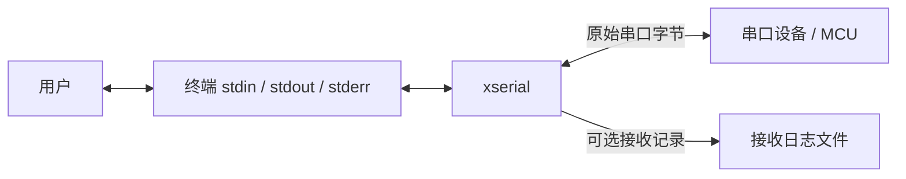

输出契约：

- raw 模式中，设备字节只写入 `stdout`，不做编码或换行转换；本地帮助、进度和诊断写入 `stderr`。
- TUI 模式明确使用 `stdout` 绘制全屏界面，设备字节由会话事件交给 TUI 渲染。
- receive log 由会话内核写入；启用 `--time` 时，时间戳只作用于日志和 TUI 展示，不改变 raw stdout。

## 2. 包与依赖层级

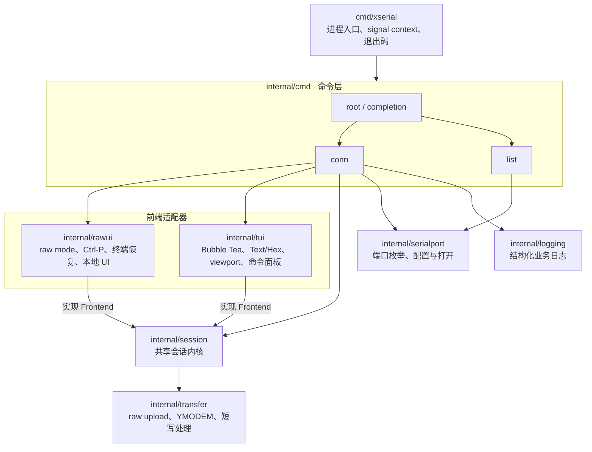

依赖始终从组装层指向能力层：

- `cmd/xserial` 不包含业务逻辑，只创建 signal context、执行根命令并呈现最终错误。
- `internal/cmd` 解析参数、打开串口与日志文件、选择前端，然后创建 `session.Session`。
- `rawui` 和 `tui` 都依赖 session 定义的窄接口，但 session 不依赖任何具体前端。
- `session` 只依赖通用的 `io.ReadWriteCloser`、logger 能力和 transfer 模块，不认识 Cobra、Bubble Tea 或第三方串口类型。
- `serialport` 隐藏 `go.bug.st/serial` 以及平台端口信息差异。

## 3. 连接组装

`xserial conn <port> [baud]` 的组装过程如下：

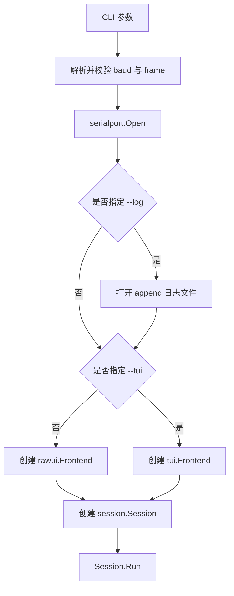

命令层在资源打开成功后把串口所有权交给 session。`Session.Run` 返回前会完成关闭和任务收敛，命令层随后关闭自己拥有的 receive log 文件。

## 4. 前后端交互协议

前端通过 `session.Endpoint` 与后端交互，不会拿到串口对象：

```go
type Frontend interface {
    Run(context.Context, Endpoint) error
}

type Endpoint interface {
    Events() <-chan Event
    Send(context.Context, []byte) error
    StartUpload(context.Context, string) error
    CancelTransfer()
    Quit()
}
```

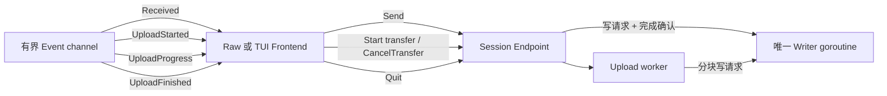

交互语义：

- `Send` 会复制调用方数据，并等待唯一 writer 返回真实写入结果。
- event channel 只由 session 创建和关闭；前端只能消费，不能关闭。
- `Received.Data` 在发出前已经复制，不会引用下一次串口读取复用的 buffer。
- 上传处于活动状态时，普通 `Send` 返回 `ErrTransferActive`，防止用户输入和文件字节交错。
- 上传进度最多约每 100 ms 发出一次，结束事件携带路径、已写字节数和错误。
- `Quit` 是对 session context 的取消请求，资源关闭仍由 Session 统一完成。

## 5. 会话运行时并发模型

一次连接包含三个常驻任务，以及按需创建的上传任务：

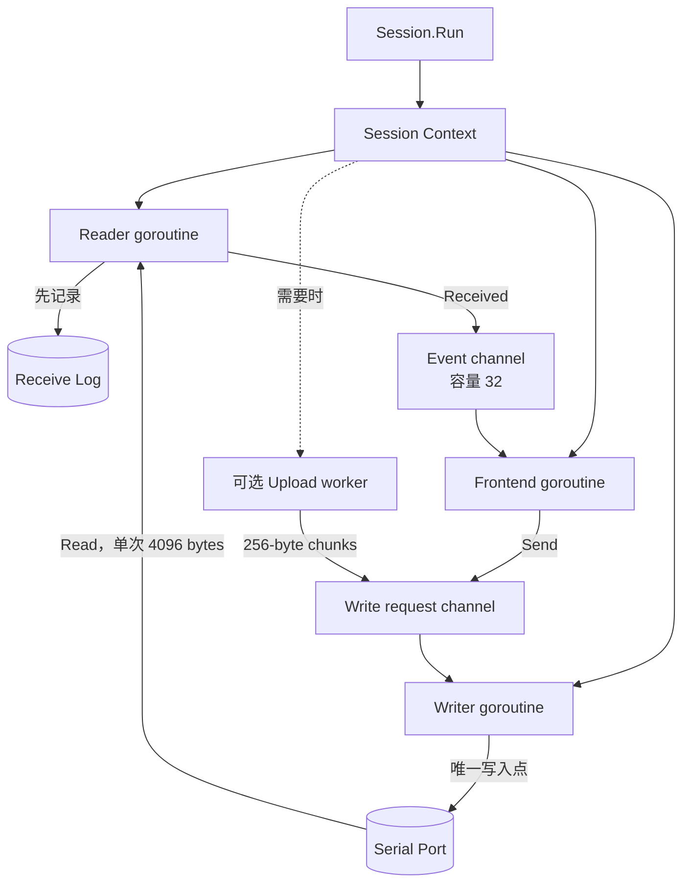

### 串口读取

reader 每次最多读取 4096 字节。收到数据后按固定顺序执行：

1. 复制本次读取的字节；
2. 写入 receive log；
3. 产生带接收时间的 `Received` 事件；
4. 等待前端消费形成有界背压，不静默丢弃设备数据。

### 串口写入

writer 是会话内唯一直接调用 `SerialPort.Write` 的 goroutine。每个请求都使用 `transfer.WriteFull` 处理短写：持续写到全部完成，或返回底层错误 / `io.ErrShortWrite`。

普通输入和上传虽然来自不同任务，但最终都会进入同一个 write request channel，因此不会并发写串口。

### Raw upload

上传 worker 验证普通文件、打开文件并以 256 字节分块读取。它响应 context 取消并通过统一 writer 写串口。raw upload 只保证字节透传，不提供协议级校验、重传或断点续传。

### YMODEM

YMODEM 作为独立 transfer 实现支持单文件上传和下载。传输期间会话 reader 仍是串口的唯一读取者，但会把收到的协议字节交给 YMODEM worker；所有协议写入继续经过统一 writer。下载使用发送端元数据中的 basename 保存到当前目录，并以独占创建方式拒绝覆盖已有文件。

transfer 在流式读写文件内容时同步计算 CRC32，并统计被拒绝或校验失败的帧与实际重传次数。重传通过事件交给 session 记录，最终统计随完成事件交给前端显示。

raw frontend 以单行进度和本地结果展示这些事件；TUI 通过命令面板启动 YMODEM 上传或下载，并在状态栏展示进度、重传和最终统计。TUI 会话不向 alternate screen 外的 stderr 写后台 session 日志，避免破坏全屏渲染。

## 6. 两种前端

### Raw frontend

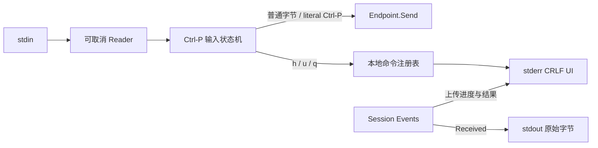

- 进入时保存终端状态并切换 raw mode，所有返回路径都恢复终端。
- `Ctrl-P` 是默认 prefix；`Ctrl-P Ctrl-P` 向设备发送 `0x10`。
- 上传路径输入、帮助和进度属于本地 UI，只写 stderr。
- session 取消时，可取消 reader 用于解除阻塞的 stdin 读取。

### TUI frontend

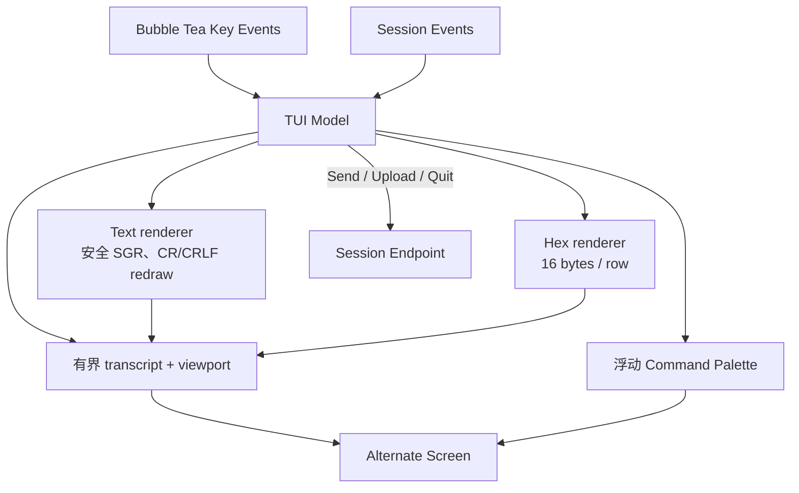

- Bubble Tea command 每次等待一个 session event，不另起串口 reader。
- Text 模式按 Enter 发送输入并追加 `CR`；设备回显只来自 `Received`，不会由 TUI 本地重复写入 transcript。
- Text renderer 保留安全的 SGR 颜色，过滤清屏、光标移动、OSC/DCS 等可能破坏整体布局的控制序列；有限支持 CR/CRLF 和整行重绘。
- Hex 模式严格解析空格分隔的两位字节，不追加 CR；接收数据按 16 字节 hexdump 展示。
- transcript 最多保留 5000 条已完成逻辑行，当前未完成行额外保存；viewport 使用终端 cell width 处理 ANSI、CJK 和滚动。
- Command Palette 使用独立浮动 layer 覆盖在主界面上，菜单状态不会替换或暂停 transcript。

## 7. 关闭协议

任何常驻任务结束、父 context 取消、用户退出或串口报错都会进入同一关闭路径：

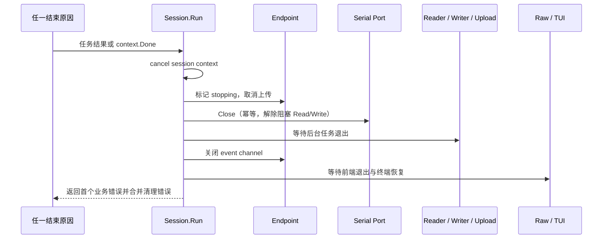

正常 EOF、用户退出和 context 取消被视为正常结束；串口读写、日志写入、前端或关闭错误向命令层返回，并保留 `errors.Is/As` 可判定性。

## 8. 日志与数据记录

业务日志和设备数据是两条不同通道：

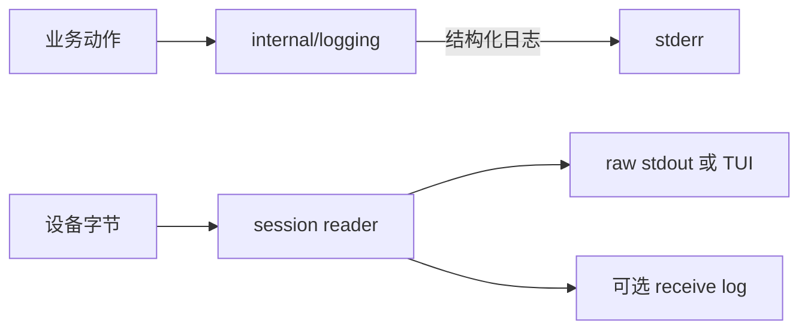

业务日志格式固定为：

```text
[ INFO | session.connected ] port="/dev/ttyUSB0" baud=115200
```

adapter 不自行记录错误；错误在掌握业务语义的命令层或 session 层记录一次，避免重复日志。

## 9. 平台与外部依赖

| 能力 | 实现 |
|---|---|
| CLI 与 completion | Cobra |
| 串口 | `go.bug.st/serial`，由 `internal/serialport` 隔离 |
| Raw terminal | `golang.org/x/term` |
| 可取消终端输入 | `github.com/muesli/cancelreader` |
| TUI runtime | Bubble Tea |
| TUI 样式、cell width 与浮动 layer | Lip Gloss |
| ANSI 解析与换行 | `github.com/charmbracelet/x/ansi` |

平台专有端口详情放在 `details*.go` 中，通过 build tags / 平台文件隔离，不向 session 或前端扩散平台判断。

## 10. 测试边界

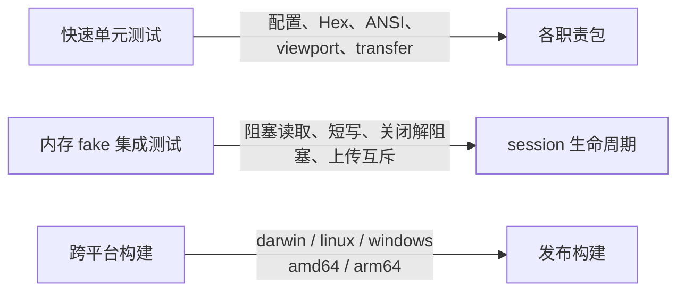

- session 测试使用能够阻塞读取、由 Close 解阻塞、产生短写并检测并发写入的 fake port。
- rawui 测试覆盖 prefix、字节透明、终端恢复和可取消输入。
- TUI 测试覆盖 Text/Hex、ANSI 安全过滤、CR 重绘、浮动命令面板、CJK 宽度和固定布局。
- transfer 测试覆盖短写、取消和非法 chunk size。
- 并发测试使用 channel/context 明确同步，不依赖 sleep 猜测调度。

## 11. CI 与发布

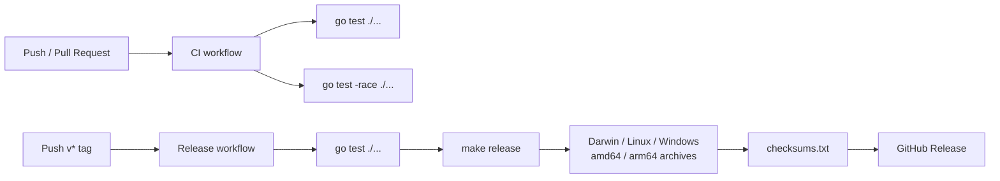

`make release` 使用 `CGO_ENABLED=0`、`-trimpath` 和 `-s -w` 生成发布二进制，并通过 ldflags 注入 tag 版本。开发构建保留调试信息。

## 12. 扩展规则

新增功能时先判断它属于哪一侧：

- 新的按键、菜单、输入方式和展示效果属于具体 frontend。
- 自动重连、录制、触发器和连接生命周期属于 session。
- DTR/RTS、平台设备信息和串口配置属于 serialport adapter。
- 新的发送算法属于 transfer；需要可靠性的协议必须与 raw upload 明确区分。
- flags、配置文件和 completion 属于命令层。

只有真实出现第二个实现，或测试需要替换外部副作用时，才在调用方一侧增加小 interface。前端与后端之间继续通过 `Frontend`、`Endpoint` 和稳定事件交互，不把具体 UI 或第三方串口类型带入 session。
